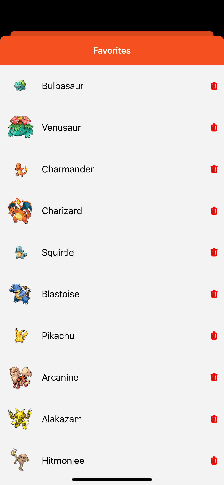
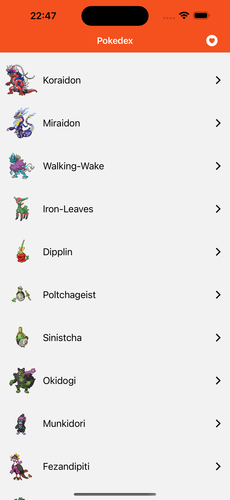

# React Native Pokedex: A High-Performance Mobile Application

## Overview

Welcome to the GitHub repository for an advanced Pokedex application, developed with React Native and the Expo Router for streamlined navigation. This app is designed to offer a rich, engaging experience for exploring the diverse world of Pokémon.

## Key Features

- **Dynamic Data Management**: Employs Tanstack React Query for optimal API data management, ensuring timely updates and a fluid user experience.
- **Local Storage Efficiency**: Incorporates MMKV for effective local data storage, improving app performance and user preference management.
- **Design Architecture**: Implements the Container-Presentational pattern, which promotes a cleaner, more maintainable, and scalable codebase.
- **Engaging Animations**: Utilizes React Native Reanimated for sophisticated animations, enhancing user interaction and visual appeal.
- **Optimized List Rendering**: Features Shopify's Flashlist for list rendering, a cutting-edge tool that significantly improves the rendering performance and efficiency of large lists, ensuring a seamless scrolling experience.

## Purpose and Functionality

This Pokedex app is not just a tool for Pokémon enthusiasts but also a demonstration of modern mobile application development techniques. It offers a detailed and responsive interface, enabling users to delve into an extensive array of Pokémon data, including traits, skills, and statistics.

## Ideal For

- Pokémon aficionados seeking a detailed and interactive digital Pokedex.
- Developers and students looking for practical examples of advanced React Native implementations.
- Anyone interested in experiencing high-performance mobile applications in action.

## Screenshots

### Detail View

### Favorites View

### List View

